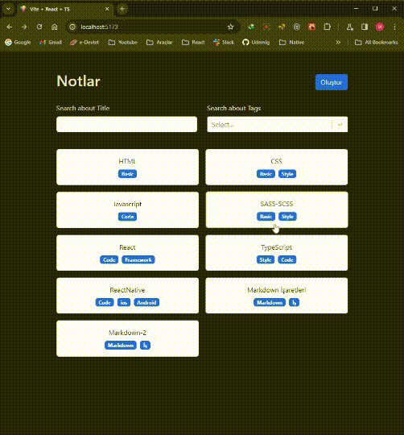

# TypeScript -CRUD

<h1> In this project, we developed a CRUD application using TypeScript. Additionally, we implemented filtering methods and utilized the following libraries: -react-markdown & -react-select & -react-dom & -react-bootstrap & -CSS module  structure & -react-router-dom</h1>

<h3>Hooks: useMemo,useRef,useNavigate,ReactSelect,useNavigate,useParams,useOutletContext</h3>

<h5>LocalStorage,CustomHook,Link,Layout,Outlet,context,useOutletContext</h5>

useOutletContext=> DetailPage-Layout

